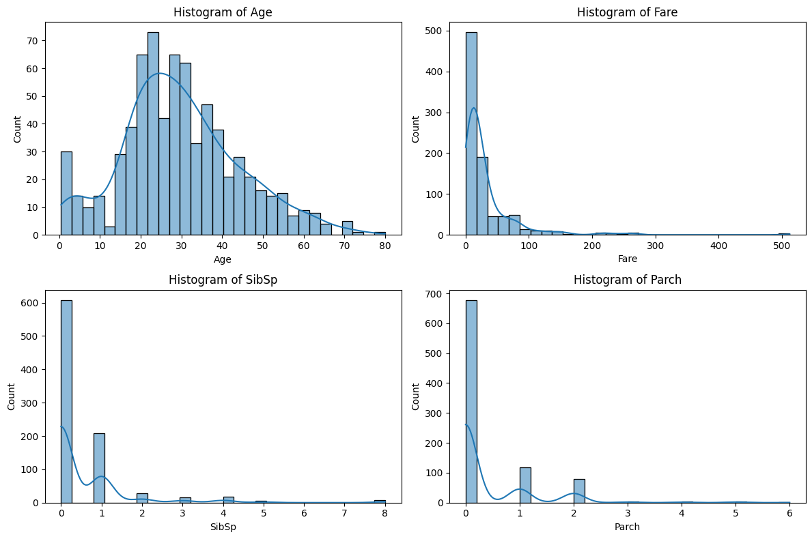
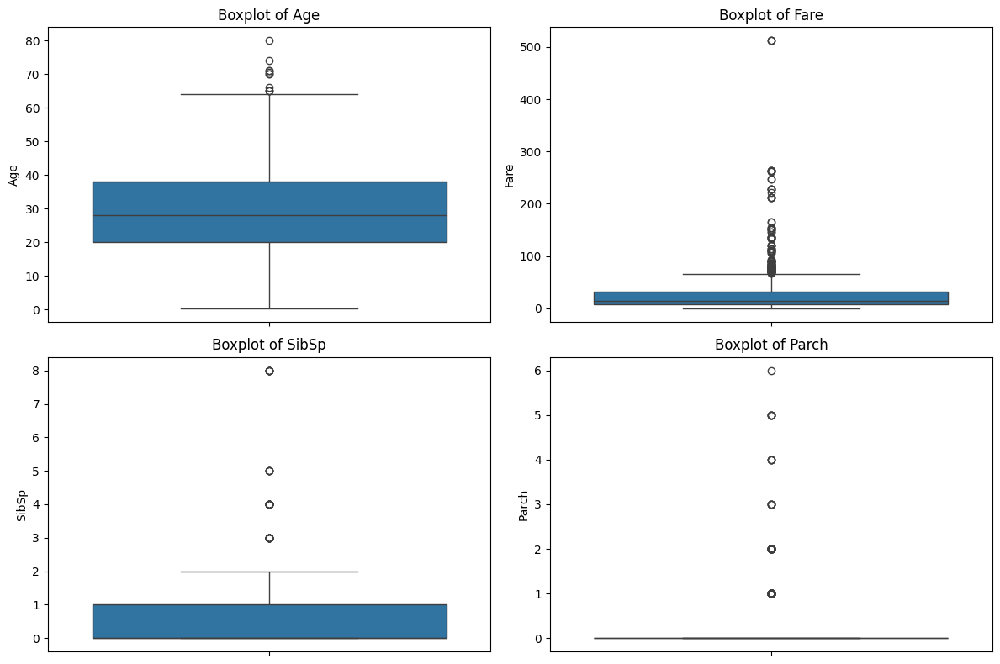
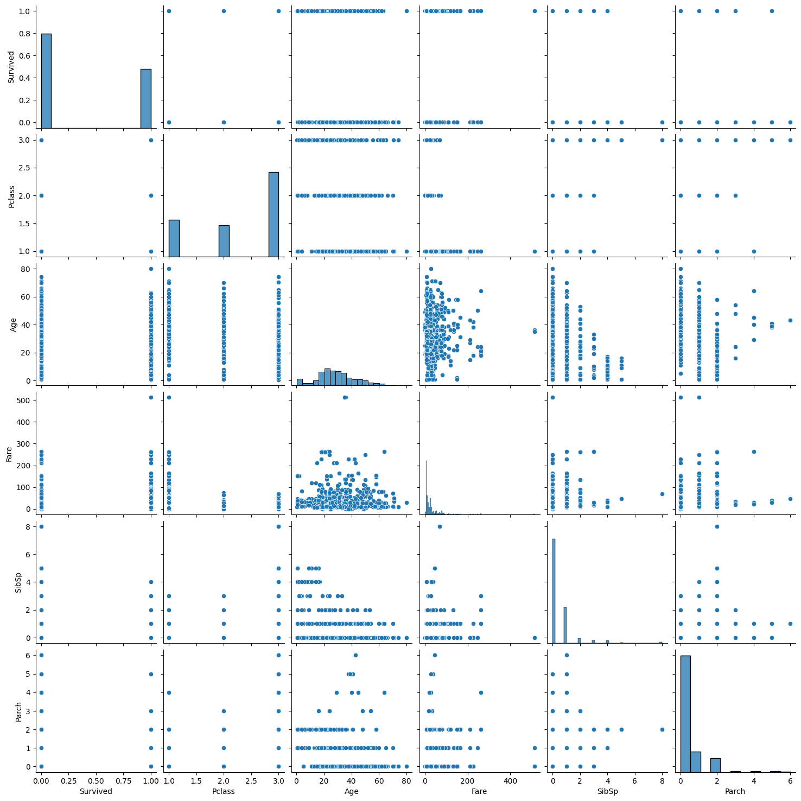
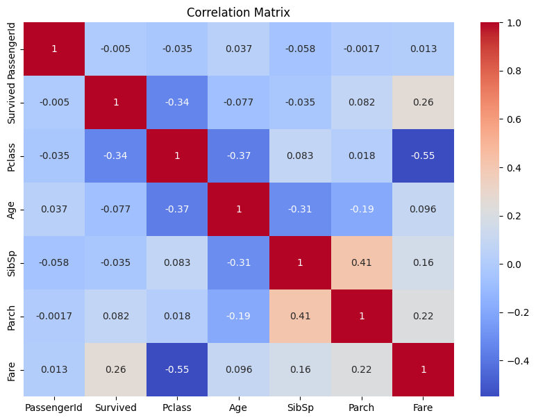
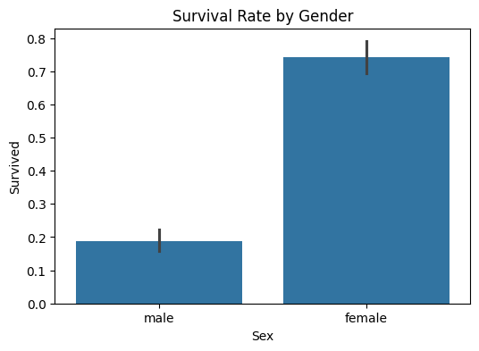
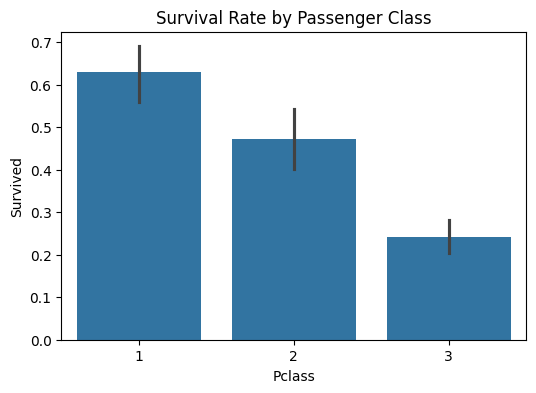

# Task-2-EDA

# 🚀 Task 2: Exploratory Data Analysis (EDA)

## 📌 Objective
To perform **Exploratory Data Analysis (EDA)** on the Titanic dataset using visualizations and summary statistics, uncovering trends, patterns, anomalies, and relationships within the data.

---

## 🛠️ Tools & Libraries Used

- Python 🐍
- Pandas 📊
- NumPy 🔢
- Matplotlib 📈
- Seaborn 📉
- Plotly 📊
- Google Colab 💻

---

## 📊 Dataset

- **Dataset Name:** Titanic Dataset  
- **Source:** Uploaded manually via Google Colab (found in `/dataset/titanic.csv`)

---

## 📖 Steps Performed

###  Generated Summary Statistics
- Inspected dataset shape, data types, and missing values.
- Generated mean, median, standard deviation, min, and max for numerical features using `.describe()`.

---

###  Visualized Numerical Features
- **Histograms** for continuous variables (`Age`, `Fare`, `SibSp`, `Parch`) to understand distributions.
- **Boxplots** to detect outliers and observe data spread.

> 📸 **Histogram**
>
> 

> 📸 **Boxplot**
>
> 

---

###  Explored Feature Relationships
- **Pairplot** for feature-to-feature relationship visualization.
- **Correlation Matrix Heatmap** to detect strongly correlated features.

> 📸 **Pairplot**
>
> 

> 📸 **Correlation Matrix**
>
> 

---

###  Identified Patterns & Trends
- **Survival Rate by Gender**
- **Survival Rate by Passenger Class**

> 📸 **Survival Rate by Gender**
>
> 

> 📸 **Survival Rate by Pclass**
>
> 

---

###  Additional Feature-level Insights
- **Age Distribution by Survival**
- **Fare Distribution by Survival (Interactive using Plotly)**

> 📸 **Age Distribution by Survival**
>
> 

---

## 📚 Key Observations

- 📌 Females had a much higher survival rate compared to males.
- 📌 Passengers from 1st Class had the highest chance of survival.
- 📌 Higher fare-paying passengers and younger passengers had better survival outcomes.
- 📌 Positive correlation between `Fare` and `Pclass`.

---

## 📂 Folder Structure

```

Task-2-EDA/
├── dataset/
│   └── titanic.csv
├── images/
│   ├── histogram.png
│   ├── boxplot.png
│   ├── pairplot.png
│   ├── correlation\_matrix.png
│   ├── Survival\_rate.png
│   ├── Survival\_rate\_2.png
│   └── Age\_distribution\_by\_survival.png
├── Task\_2\_Exploratory\_Data\_Analysis.ipynb
├── README.md

````

---

##  How to Run

1. Open Google Colab.
2. Upload the `titanic.csv` file via:
   ```python
   from google.colab import files
   files.upload()
````

3. Run the notebook `Task_2_Exploratory_Data_Analysis.ipynb`
4. View visualizations inside the notebook or in `/images/` folder for static images.

---

## 📚 Conclusion

Successfully performed **Exploratory Data Analysis (EDA)** on the Titanic dataset, revealing important patterns and trends in survival rates and feature relationships, laying a solid foundation for future predictive modeling.

---

## Author

**P. Yaswanth Kumar**

